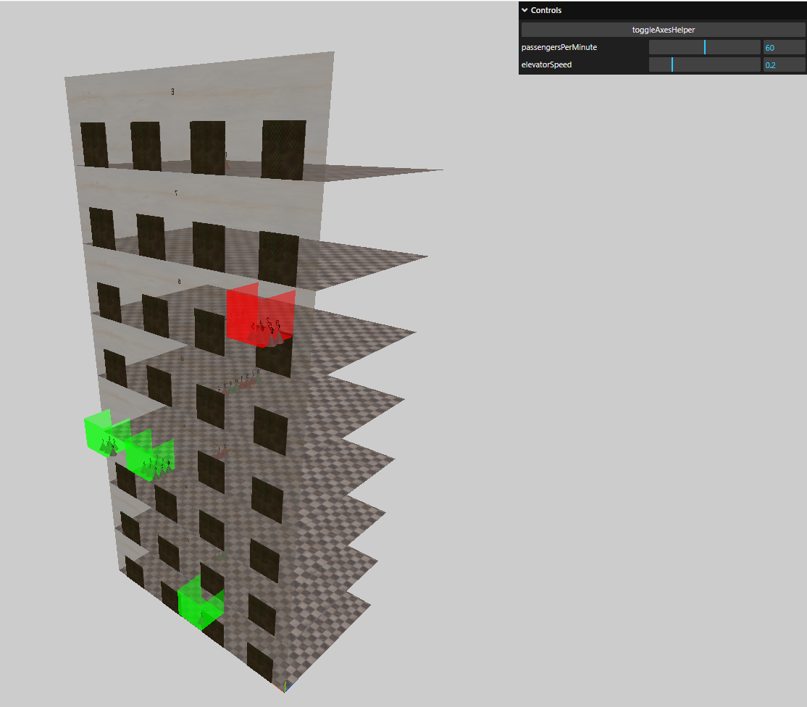

# Three.js Elevator Simulator Practice

[Demo](http://elevator-simulation-three-js.herokuapp.com/)



## Setup

Download [Node.js](https://nodejs.org/en/download/).
Run this followed commands:

```bash
# Install dependencies (only the first time)
npm install

# Run the local server at localhost:8080
npm run start

# Build for production in the dist/ directory
npm run build
```
